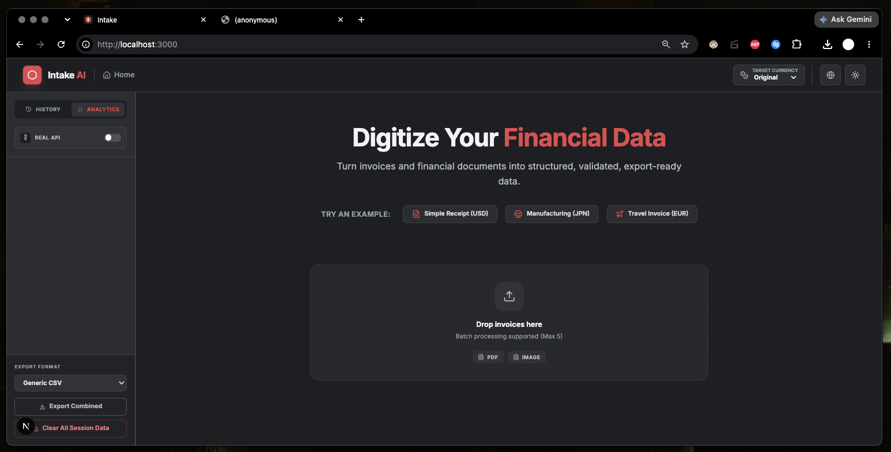
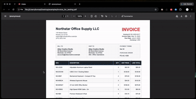
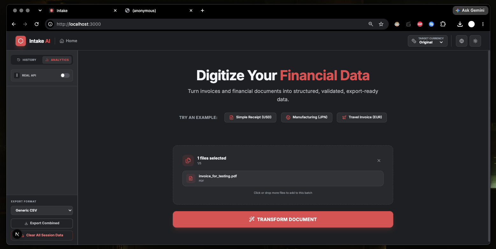
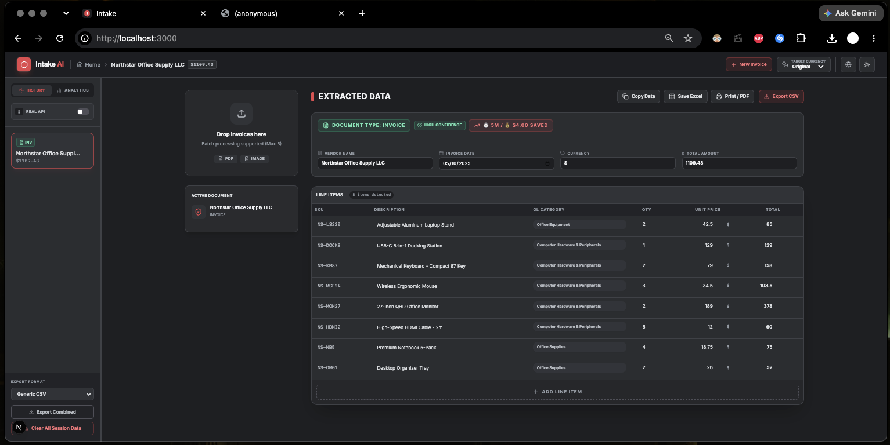
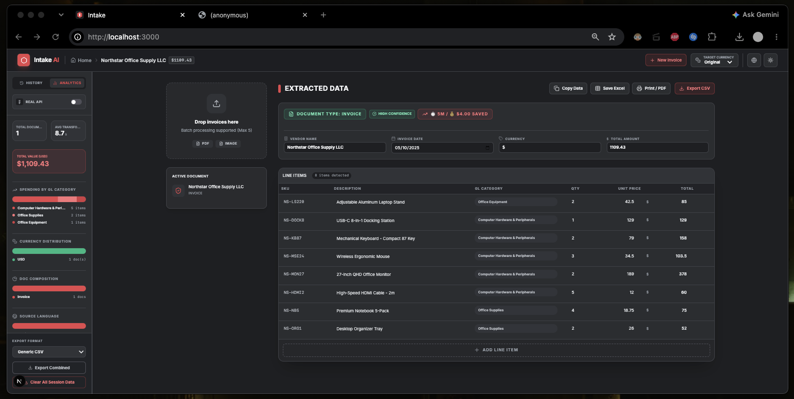

# Intake AI

**AI-powered document intake for extracting, validating, and structuring financial data.**

Intake AI turns photos and PDFs of receipts, invoices, and other financial documents into structured, editable data that's ready to review and export into spreadsheets, accounting workflows, or databases.

[Live Demo](https://intake.stevenmallqui.com) · [Portfolio](https://stevenmallqui.com)

> Originally built during **HawkHack 2025 at Montclair State University**, then expanded into a more complete document-processing app.

<p align="center">
  
</p>

## Demo

Intake AI takes an unstructured financial document and turns it into structured, reviewable, export-ready data.

<p align="center">
  
</p>

## Overview

Manually entering data from receipts and invoices is repetitive, slow, and error-prone. Intake AI explores a faster way to do it.

Users upload an image or PDF, and the app uses Google's Gemini API to pull out fields like:

- Document type, vendor, invoice date, currency, total amount
- SKUs, item descriptions, quantities, unit prices, line totals
- GL categories

The extracted data lands in an editable interface so users can check it over before exporting as **CSV, Excel-compatible XLS, JSON, or QuickBooks-compatible CSV**.

The goal isn't just reading text off a document — it's turning that unstructured document into structured data that actually fits into a real workflow.

## Features

- Image and PDF document processing, including multi-document batches
- AI-powered extraction using Google Gemini
- Structured document and line-item output
- Editable results before export
- Automatic GL category suggestions
- Math mismatch detection and recalculation
- Duplicate document detection
- CSV, Excel-compatible (`.xls`), JSON, and QuickBooks-compatible exports
- Print / Save as PDF
- Currency conversion previews
- Session history and analytics (spending breakdowns, categories, document types)
- Multi-language interface, light/dark themes
- Demo mode for trying it without burning API usage

## How It Works

```text
Image / PDF
    ↓
Next.js API Route
    ↓
Google Gemini
    ↓
Structured Document Data
    ↓
Validation & Review
    ↓
CSV / Excel / QuickBooks / JSON
```

1. User uploads an image or PDF of a financial document.
2. It's sent to a server-side Next.js API route.
3. Gemini analyzes the document and returns structured data against a defined response schema.
4. The app layers on additional logic — validation, duplicate detection, calculations, formatting.
5. The extracted data is shown in an editable interface for review.
6. The final data exports for spreadsheets, accounting workflows, databases, or wherever it's needed.

## Screenshots

**Upload** — receipts, invoices, and other financial documents as images or PDFs, with batch support.

<p align="center">
  
</p>

**Extraction & Review** — verify fields, review line items, and fix anything before export.

<p align="center">
  
</p>

**History & Analytics** — processed documents stay available for the session, with lightweight analytics on totals, categories, currencies, and recent activity.

<p align="center">
  
</p>

## Tech Stack

`JavaScript / JSX` · `Next.js` · `React` · `Tailwind CSS` · `Google Gemini API` · `Vercel`

Also leans on browser APIs for file handling, clipboard support, printing, and client-side export generation.

## AI Integration

This was the first project where a generative AI model became part of the actual data pipeline rather than a chatbot bolted on the side.

Instead of treating Gemini as a conversational layer, the app sends it documents and asks for structured output that the rest of the system can act on directly. Gemini handles the probabilistic part — reading and understanding the document — while ordinary application logic handles the deterministic part: validation, duplicate detection, math checks, recalculation, workflow state, risk flags, and export generation.

Building this gave me real hands-on experience with multimodal AI, structured/schema-constrained model output, prompt design, and designing interfaces around AI output that's usually good but still needs a human check.

## Project Origin

Intake AI started at **HawkHack 2025 at Montclair State University**. I wanted to build something rooted in data and databases while solving an actually annoying problem — the repetitive grind of manually transferring numbers from receipts and invoices into spreadsheets and accounting tools.

The hackathon was a good excuse to experiment with using AI to bridge unstructured documents and structured data. After the event, I kept building — improving the interface, validation flow, export options, analytics, and localization.

## What I Learned

- Integrating Google's Gemini API and working with multimodal inputs
- Designing structured, schema-constrained AI responses
- Keeping AI-generated output cleanly separated from deterministic app logic
- Handling API errors and usage limits gracefully
- Building editable UI around AI-generated data
- Generating CSV, Excel-compatible, and JSON exports
- Managing multi-step processing state in React
- Building responsive UI with React and Tailwind, including light/dark themes

A lot of the frontend patterns from this project are ones I plan to reuse going forward.

## Practical Use Cases

Accounts payable, bookkeeping, invoice processing, expense management, procurement, financial reconciliation, spreadsheet prep, database entry, document digitization, and general internal business tooling.

```text
Traditional Workflow                 Intake AI Workflow

Receipt / Invoice                    Receipt / Invoice
       ↓                                    ↓
Manual Data Entry                     Intake AI
       ↓                                    ↓
Spreadsheet / Accounting System       Review Structured Data
                                             ↓
                                      CSV / Excel / QuickBooks / JSON
```

## Running Locally

```bash
git clone https://github.com/smallqui/intake-ai.git
cd intake-ai
npm install
cp .env.example .env.local
```

Add your Gemini API key to `.env.local`:

```env
GEMINI_API_KEY=your_key_here
```

Start the dev server:

```bash
npm run dev
```

Then open `http://localhost:3000`.

## Limitations

- AI-generated data can contain errors and should be reviewed before use in real financial systems
- Currency conversion uses static approximate rates, not a live exchange-rate feed
- Sensitive-data detection is lightweight pattern matching, not a compliance-grade solution
- Document history is session-based, not persisted to a database
- QuickBooks export produces compatible CSV data rather than a native IIF file

## Future Improvements

- Persistent storage and database integration
- User accounts
- Live currency exchange rates
- Additional accounting-platform exports
- More advanced document validation and confidence scoring
- Larger batch-processing workflows and expanded analytics
- Support for more document types

## Author

**Steven Mallqui**
[Portfolio](https://stevenmallqui.com) · [GitHub](https://github.com/smallqui)